# HTPC Download Box

Sonarr / Radarr / Jackett / NZBGet / Deluge / OpenVPN / Plex

TV shows and movies download, sort, with the desired quality and subtitles, behind a VPN (optional), ready to watch, in a beautiful media player.
All automated.

## Table of Contents

- [HTPC Download Box](#htpc-download-box)
  - [Table of Contents](#table-of-contents)
  - [Overview](#overview)
    - [Monitor TV shows/movies with Sonarr and Radarr](#monitor-tv-showsmovies-with-sonarr-and-radarr)
    - [Search for releases automatically with Usenet and torrent indexers](#search-for-releases-automatically-with-usenet-and-torrent-indexers)
    - [Handle bittorrent and usenet downloads with Deluge and NZBGet](#handle-bittorrent-and-usenet-downloads-with-deluge-and-nzbget)
    - [Organize libraries, fetch subtitles and play videos with Plex](#organize-libraries-fetch-subtitles-and-play-videos-with-plex)
  - [Hardware configuration](#hardware-configuration)
  - [Software stack](#software-stack)
  - [Installation guide](#installation-guide)
    - [Introduction](#introduction)
    - [Install docker and docker-compose](#install-docker-and-docker-compose)
    - [Setup Deluge](#setup-deluge)
      - [Docker container](#docker-container)
      - [Configuration](#configuration)
    - [Setup a VPN Container](#setup-a-vpn-container)
      - [Introduction](#introduction)
      - [privateinternetaccess.com custom setup](#privateinternetaccesscom-custom-setup)
      - [Docker container](#docker-container)
    - [Setup Jackett](#setup-jackett)
      - [Docker container](#docker-container)
      - [Configuration and usage](#configuration-and-usage)
    - [Setup NZBGet](#setup-nzbget)
      - [Docker container](#docker-container)
      - [Configuration and usage](#configuration-and-usage)
    - [Setup Plex](#setup-plex)
      - [Media Server Docker Container](#media-server-docker-container)
      - [Configuration](#configuration)
      - [Download subtitles automatically with sub-zero](#download-subtitles-automatically-with-sub-zero)
      - [Setup Plex clients](#setup-plex-clients)
    - [Setup Sonarr](#setup-sonarr)
      - [Docker container](#docker-container)
      - [Configuration](#configuration)
      - [Give it a try](#give-it-a-try)
    - [Setup Radarr](#setup-radarr)
      - [Docker container](#docker-container)
      - [Configuration](#configuration)
      - [Give it a try](#give-it-a-try)
      - [Movie discovering](#movie-discovering)
  - [Manage it all from your mobile](#manage-it-all-from-your-mobile)
  - [Going Further](#going-further)

## Overview

This is what I have set up at home to handle TV shows and movies automated download, sort and play.

*Disclaimer: I'm not encouraging/supporting piracy, this is for information purpose only.*

How does it work? I rely on several tools integrated together. They're all open-source, and deployed as Docker containers on my Linux server.

The common workflow is detailed in this first section to give you an idea of how things work.

### Monitor TV shows/movies with Sonarr and Radarr

Using [Sonarr](https://sonarr.tv/) Web UI, search for a TV show by name and mark it as monitored. You can specify a language and the required quality (1080p for instance). Sonarr will automatically take care of analyzing existing episodes and seasons of this TV show. It compares what you have on disk with the TV show release schedule, and triggers download for missing episodes. It also takes care of upgrading your existing episodes if a better quality matching your criterias is available out there.

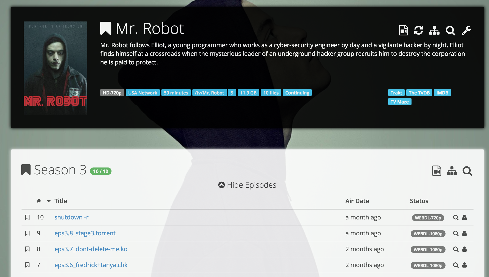
Sonarr triggers download batches for entire seasons. But it also handle upcoming episodes and seasons on-the-fly. No human intervention is required for all the episodes to be released from now on.

When the download is over, Sonarr moves the file to the appropriate location (`my-tv-shows/show-name/season-1/01-title.mp4`), and renames the file if needed.

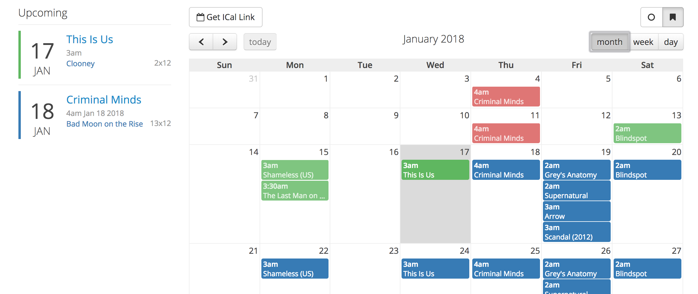

[Radarr](https://radarr.video) is the exact same thing, but for movies.

### Search for releases automatically with Usenet and torrent indexers

Sonarr and Radarr can both rely on two different ways to download files:

- Usenet (newsgroups) bin files. That's the historical and principal option, for several reasons: consistency and quality of the releases, download speed, indexers organization, etc. Often requires a paid subscription to newsgroup servers.
- Torrents. That's the new player in town, for which support has improved a lot lately.

I'm using both systems simultaneously, torrents being used only when a release is not found on newsgroups, or when the server is down. At some point I might switch to torrents only, which work really fine as well.

Files are searched automatically by Sonarr/Radarr through a list of  *indexers* that you have to configure. Indexers are APIs that allow searching for particular releases organized by categories. Think browsing the Pirate Bay programmatically. This is a pretty common feature for newsgroups indexers that respect a common API (called `Newznab`).
However this common protocol does not really exist for torrent indexers. That's why we'll be using another tool called [Jackett](https://github.com/Jackett/Jackett). You can consider it as a local proxy API for the most popular torrent indexers. It searches and parse information from heterogeneous websites.


The best release matching your criteria is selected by Sonarr/Radarr (eg. non-blacklisted 1080p release with enough seeds). Then the download is passed on to another set of tools.

### Handle bittorrent and usenet downloads with Deluge and NZBGet

Sonarr and Radarr are plugged to downloaders for our 2 different systems:

- [NZBGet](https://nzbget.net/) handles Usenet (newsgroups) binary downloads.
- [Deluge](http://deluge-torrent.org/) handles torrent download.

Both are daemons coming with a nice Web UI, making them perfect candidates for being installed on a server. Sonarr & Radarr already have integration with them, meaning they rely on each service API to pass on downloads, request download status and handle finished downloads.

Both are very standard and popular tools. I'm using them for their integration with Sonarr/Radarr but also as standalone downloaders for everything else.

For security and anonymity reasons, I'm running Deluge behind a VPN connection. All incoming/outgoing traffic from deluge is encrypted and goes out to an external VPN server. Other service stay on my local network. This is done through Docker networking stack (more to come on the next paragraphs).

### Organize libraries, fetch subtitles and play videos with Plex

[Plex](https://www.plex.tv/) Media Server organize all your medias as libraries. You can set up one for TV shows and another one for movies.
It automatically grabs metadata for each new release (description, actors, images, release date). A very nice feature that we'll use a lot is the [sub-zero plugin](https://github.com/pannal/Sub-Zero.bundle). Whenever a new video arrives in Plex library, sub-zero automatically searches and downloads the most appropriate subtitle from a list of subtitle providers, based on several criterias (release name, quality, popularity, etc).

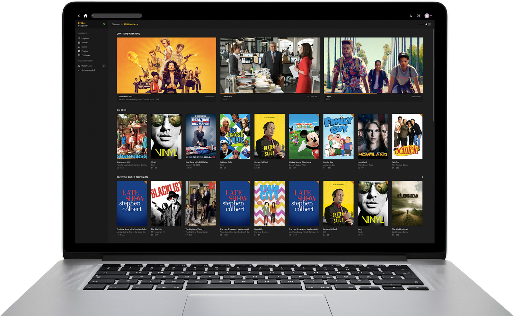

Plex keeps track of your position in the entire library: what episode of a given TV show season you've watched, what movie you've not watched yet, what episode was added to the library since last time. It also remembers where you stopped within a video file. Basically you can pause a movie in your bedroom, then resume playback from another device in your bathroom.

Plex comes with [clients](https://www.plex.tv/apps/) in a lot of different systems (Web UI, Linux, Windows, OSX, iOS, Android, Android TV, Chromecast, PS4, Smart TV, etc.) that allow you to display and watch all your shows/movies in a nice Netflix-like UI.

The server has transcoding abilities: it automatically transcodes video quality if needed (eg. stream your 1080p movie in 480p if watched from a mobile with low bandwidth).

## Hardware configuration

I'm using an old [Proliant MicroServer N54L](http://www.minimachines.net/promos-et-sorties/bon-plan-un-micro-serveur-hp-proliant-4-emplacements-a-169e-371) (2 cores, 2.20GHz) that I tweaked a bit to have 6GB RAM, an additional graphic card for better Full HD decoding, and an additional 2TB disk for data.

It has Ubuntu 17.10.1 with Docker installed.

You can also use a Raspberry Pi, a Synology NAS, a Windows or Mac computer. The stack should work fine on all these systems, but you'll have to adapt the Docker stack below to your OS. I'll only focus on a standard Linux installation here.

## Software stack

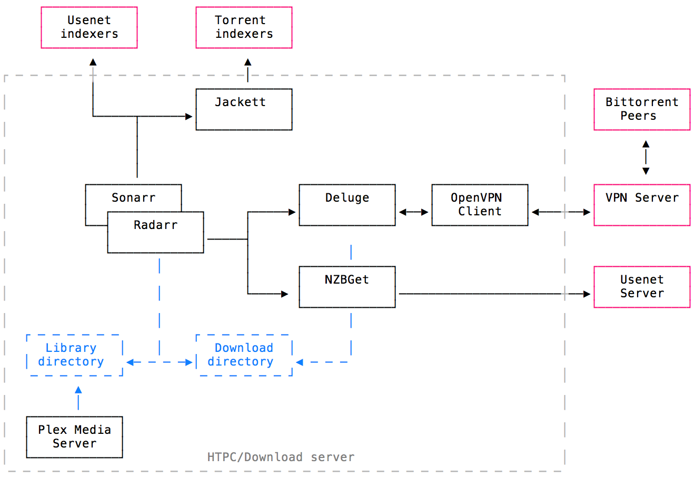

**Downloaders**:

- [Deluge](http://deluge-torrent.org): torrent downloader with a web UI
- [NZBGet](https://nzbget.net): usenet downloader with a web UI
- [Jackett](https://github.com/Jackett/Jackett): API to search torrents from multiple indexers

**Download orchestration**:

- [Sonarr](https://sonarr.tv): manage TV show, automatic downloads, sort & rename
- [Radarr](https://radarr.video): basically the same as Sonarr, but for movies

**VPN**:

- [OpenVPN](https://openvpn.net/) client configured with a [privateinternetaccess.com](https://www.privateinternetaccess.com/) access

**Media Center**:

- [Plex](https://plex.tv): media center server with streaming transcoding features, useful plugins and a beautiful UI. Clients available for a lot of systems (Linux/OSX/Windows, Web, Android, Chromecast, Android TV, etc.)
- [Sub-Zero](https://github.com/pannal/Sub-Zero.bundle): subtitle auto-download channel for Plex

## Installation guide

### Introduction

The idea is to set up all these components as Docker containers in a `docker-compose.yml` file.
We'll reuse community-maintained images (special thanks to [linuxserver.io](https://www.linuxserver.io/) for many of them).
I'm assuming you have some basic knowledge of Linux and Docker.
I'll try to maintain my own `docker-compose` file [here](https://github.com/sebgl/htpc-download-box/blob/master/docker-compose.yml).

The stack is not really plug-and-play. You'll see that manual human configuration is required for most of these tools. Configuration is not fully automated (yet?), but is persisted on reboot. Some steps also depend on external accounts that you need to set up yourself (usenet indexers, torrent indexers, vpn server, plex account, etc.). We'll walk through it.

Optional steps described below that you may wish to skip:

- Using a VPN server for Deluge incoming/outgoing traffic.
- Using newsgroups (Usenet): you can skip NZBGet installation and all related Sonarr/Radarr indexers configuration if you wish to use bittorrent only.

### Install docker and docker-compose

See the [official instructions](https://docs.docker.com/engine/installation/linux/docker-ce/ubuntu/#install-docker-ce-1) to install Docker.

Then add yourself to the `docker` group:
`sudo usermod -aG docker zao`

Make sure it works fine:
`docker run hello-world`

Also install docker-compose (see the [official instructions](https://docs.docker.com/compose/install/#install-compose)).

### Setup Deluge

#### Docker container

We'll use deluge Docker image from linuxserver, which runs both the deluge daemon and web UI in a single container.

```yaml
version: '3'
services:

  deluge:
    container_name: deluge
    image: linuxserver/deluge:102
    network_mode: host # run on the host network directly, web UI on port 8112
    environment:
      - PUID=1000 # default user id, for downloaded files access rights
      - PGID=1000 # default group id, for downloaded files access rights
      - TZ=Europe/Paris # timezone
    volumes:
      - /media/${USER}/data1/downloads/deluge:/downloads # download folder
      - ${HOME}/.config/deluge:/config # config files
```

Things to notice:

- replace PUID and GUID with your own user UID and GID (run `id $USER` to get them)
- I use the host network to simplify configuration. Important ports are `8112` (web UI) and `58846` (bittorrent daemon).
- Set both volumes accordingly to your desired setup. I chose to store downloaded files on an external volume, and configuration files in my HOME directory.

Then run the container with `docker-compose up -d`.
To follow container logs, run `docker-compose logs -f deluge`.

#### Configuration

You should be able to login on the web UI (`localhost:8112`, replace `localhost` by your machine ip if needed).

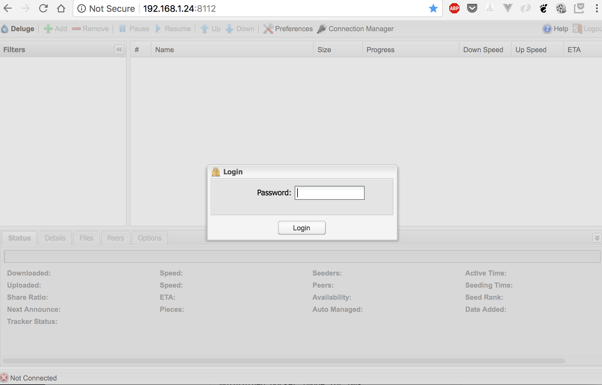

The default password is `deluge`. You are asked to modify it, I chose to set an empty one since deluge won't be accessible from outside my local network.

The running deluge daemon should be automatically detected and appear as online, you can connect to it.

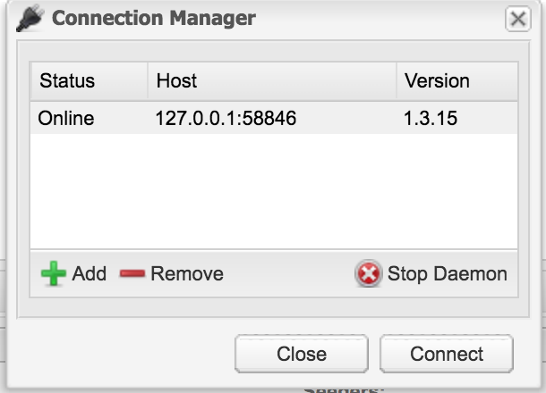

You may want to change the download directory. I like to have to distinct directories for incomplete (ongoing) downloads, and complete (finished) ones.
Also, I set up a blackhole directory: every torrent file in there will be downloaded automatically. This is useful for Jackett manual searches. You should activate `autoadd` in the plugins section: it adds supports for `.magnet` files.

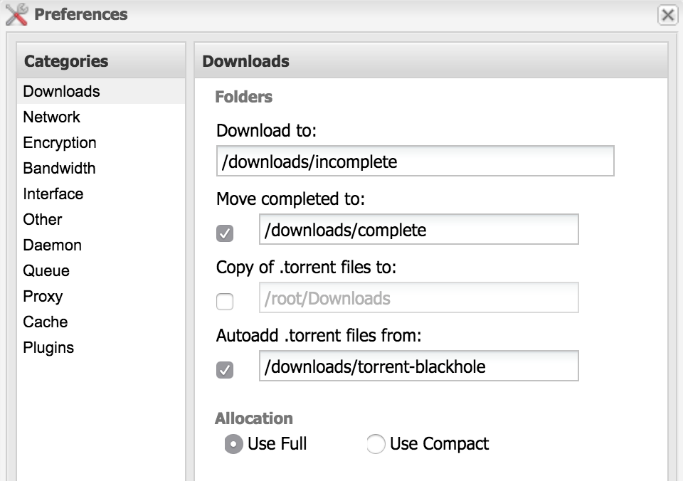

You can also tweak queue settings, defaults are fairly small. Also you can decide to stop seeding after a certain ratio is reached. That will be useful for Sonarr, since Sonarr can only remove finished downloads from deluge when the torrent has stopped seeding. Setting a very low ratio is not very fair though !

Configuration gets stored automatically in your mounted volume (`${HOME}/.config/deluge`) to be re-used at container restart. Important files in there:

- `auth` contains your login/password
- `core.conf` contains your deluge configuration

You can use the Web UI manually to download any torrent from a .torrent file or magnet hash.

### Setup a VPN Container

#### Introduction

The goal here is to have an OpenVPN Client container running and always connected. We'll make Deluge incoming and outgoing traffic go through this OpenVPN container.

This must come up with some safety features:

1. VPN connection should be restarted if not responsive
1. Traffic should be allowed through the VPN tunnel *only*, no leaky outgoing connection if the VPN is down
1. Deluge Web UI should still be reachable from the local network

Lucky me, someone already [set that up quite nicely](https://github.com/dperson/openvpn-client).

Point 1 is resolved through the OpenVPN configuration (`ping-restart` set to 120 sec by default).
Point 2 is resolved through [iptables rules](https://github.com/dperson/openvpn-client/blob/master/openvpn.sh#L52-L87)
Point 3 is also resolved through [iptables rules](https://github.com/dperson/openvpn-client/blob/master/openvpn.sh#L104)

Configuration is explained on the [project page](https://github.com/dperson/openvpn-client), you can follow it.
However it is not that easy depending on your VPN server settings.
I'm using a privateinternetaccess.com VPN, so here is how I set it up.

#### privateinternetaccess.com custom setup

*Note*: this section only applies for [PIA](https://privateinternetaccess.com) accounts.

Download PIA OpenVPN [configuration files](https://privateinternetaccess.com/openvpn/openvpn.zip).
In the archive, you'll find a bunch of `<country>.ovpn` files, along with 2 other important files: `crl.rsa.2048.pem` and `ca.rsa.2048.crt`. Pick the file associated to the country you'd like to connect to, for example `netherlands.ovpn`.
Copy the 3 files to `${HOME}/.vpn`.
Create a 4th file `vpn.auth` with the following content:

```Text
<pia username>
<pia password>
```

You should now have 3 files in `${HOME}/.vpn`:

- netherlands.ovpn
- vpn.auth
- crl.rsa.2048.pem
- ca.rsa.2048.crt

Edit `netherlands.ovpn` (or any other country of your choice) to tweak a few things (see my comments on lines added or modified):

```INI
client
dev tun
proto udp
remote nl.privateinternetaccess.com 1198
resolv-retry infinite
nobind
persist-key
# persist-tun # disable to completely reset vpn connection on failure
cipher aes-128-cbc
auth sha1
tls-client
remote-cert-tls server
auth-user-pass /vpn/vpn.auth # to be reachable inside the container
comp-lzo
verb 1
reneg-sec 0
crl-verify /vpn/crl.rsa.2048.pem # to be reachable inside the container
ca /vpn/ca.rsa.2048.crt # to be reachable inside the container
disable-occ
keepalive 10 30 # send a ping every 10 sec and reconnect after 30 sec of unsuccessfull pings
pull-filter ignore "auth-token" # fix PIA reconnection auth error that may occur every 8 hours
```

Then, rename `<country>.ovpn` to `vpn.conf`

#### Docker container

Put it in the docker-compose file, and make deluge use the vpn container network:

```yaml
vpn:
    container_name: vpn
    image: dperson/openvpn-client:latest
    cap_add:
      - net_admin # required to modify network interfaces
    restart: unless-stopped
    volumes:
      - /dev/net/tun:/dev/net/tun # tun device
      - ${HOME}/.vpn:/vpn # OpenVPN configuration
    ports:
      - 8112:8112 # port for deluge web UI to be reachable from local network
    command: '-r 192.168.1.0/24' # route local network traffic

 deluge:
    container_name: deluge
    image: linuxserver/deluge:102
    restart: unless-stopped
    network_mode: service:vpn # run on the vpn network
    environment:
      - PUID=1000 # default user id, for downloaded files access rights
      - PGID=1000 # default group id, for downloaded files access rights
      - TZ=Europe/Paris # timezone
    volumes:
      - /media/${USER}/data1/downloads/deluge:/downloads # download folder
      - ${HOME}/.config/deluge:/config # config files
```

Notice how deluge is now using the vpn container network, with deluge web UI port exposed on the vpn container for local network access.

You can check that deluge is properly going out through the VPN IP by using [torguard check](https://torguard.net/checkmytorrentipaddress.php).
Get the torrent magnet link there, put it in Deluge, wait a bit, then you should see your outgoing torrent IP on the website.


### Setup Jackett

[Jackett](https://github.com/Jackett/Jackett) translates request from Sonarr and Radarr to searches for torrents on popular torrent websites, even though those website do not have a sandard common APIs (to be clear: it parses html for many of them :)).

#### Docker container

No surprise: let's use linuxserver.io container !

```yaml
jackett:
    container_name: jackett
    image: linuxserver/jackett:100
    restart: unless-stopped
    network_mode: host
    environment:
      - PUID=1000 # default user id, for downloaded files access rights
      - PGID=1000 # default group id, for downloaded files access rights
      - TZ=Europe/Paris # timezone
    volumes:
      - /etc/localtime:/etc/localtime:ro
      - /media/${USER}/data1/downloads/ongoing/torrent-blackhole:/downloads # place where to put .torrent files
      - ${HOME}/.config/jackett:/config # config files
```

Nothing particular in this configuration, it's pretty similar to other linuxserver.io images.
An interesting setting is the torrent blackhole directory. When you do manual searches, Jackett will put `.torrent` files there, to be grabbed by your torrent client directly (Deluge for instance).

As usual, run with `docker-compose up -d`.

#### Configuration and usage

Jackett web UI is available on port 9117.

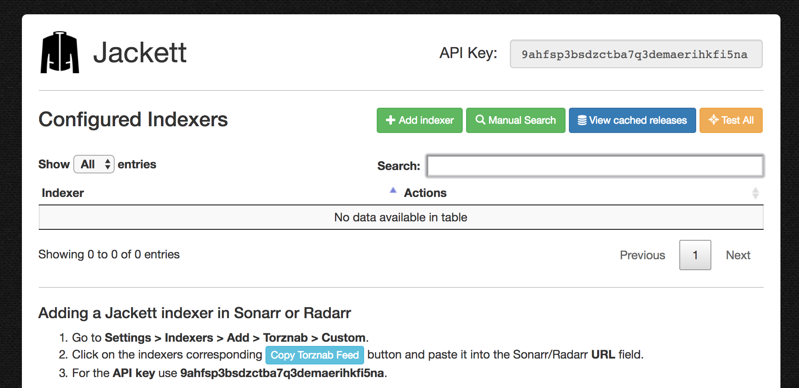

Configuration is available at the bottom of the page. I chose to disable auto-update (I'll rely on the docker images tags myself), and to set `/downloads` as my blackhole directory.

Click on `Add Indexer` and add any torrent indexer that you like. I added 1337x, cpasbien, RARBG, The Pirate Bay and YGGTorrent (need a user/password).

You can now perform a manual search across multiple torrent indexers in a clean interface with no trillion ads pop-up everywhere. Then choose to save the .torrent file to the configured blackhole directory, ready to be picked up by Deluge automatically !

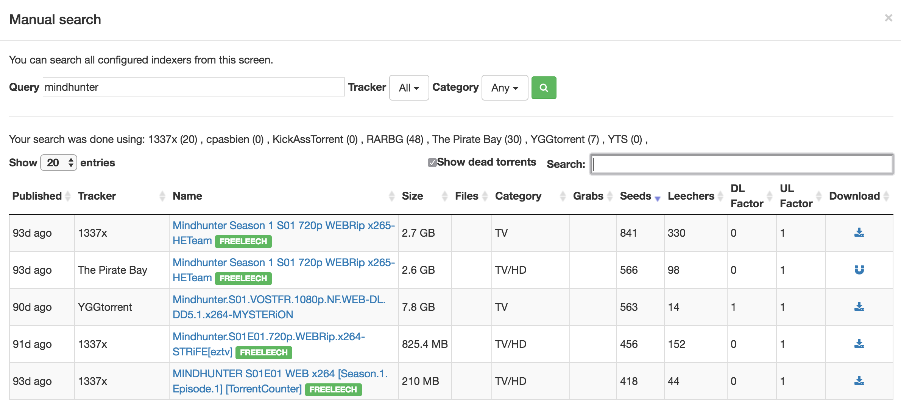

### Setup NZBGet

#### Docker container

Once again we'll use the Docker image from linuxserver and set it in a docker-compose file.

```yaml
nzbget:
    container_name: nzbget
    image: linuxserver/nzbget:101
    restart: unless-stopped
    network_mode: host
    environment:
      - PUID=1000 # default user id, for downloaded files access rights
      - PGID=1000 # default group id, for downloaded files access rights
      - TZ=Europe/Paris # timezone
    volumes:
      - /media/${USER}/data1/downloads/nzbget:/downloads # download folder
      - ${HOME}/.config/nzbget:/config # config files
```

#### Configuration and usage

After running the container, web UI should be available on `localhost:6789`.
Username: nzbget
Password: tegbzn6789

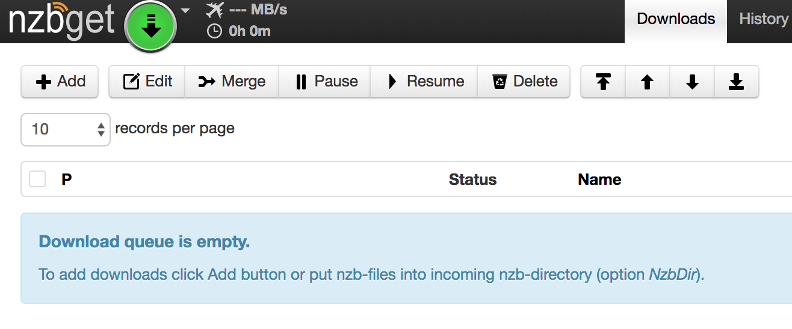

Since NZBGet stays on my local network, I choose to disable passwords (`Settings/Security/ControlPassword` set to empty).

The important thing to configure is the url and credentials of your newsgroups server (`Settings/News-servers`). I have a Frugal Usenet account at the moment, I set it up with TLS encryption enabled.

Default configuration suits me well, but don't hesitate to have a look at the `Paths` configuration.

You can manually add .nzb files to download, but the goal is of course to have Sonarr and Radarr take care of it automatically.

### Setup Plex

#### Media Server Docker Container

Luckily for us, Plex team already provides a maintained [Docker image for pms](https://github.com/plexinc/pms-docker).

We'll use the host network directly, and run our container with the following configuration:

```yaml
plex-server:
    container_name: plex-server
    image: plexinc/pms-docker:1.10.1.4602-f54242b6b
    restart: unless-stopped
    environment:
      - TZ=Europe/Paris # timezone
    network_mode: host
    volumes:
      - ${HOME}/.plex/db:/config # plex database
      - ${HOME}/.plex/transcode:/transcode # temp transcoded files
      - /media/${USER}/data1/downloads/complete:/data # media library
```

It's important to set volumes correctly for configuration to be persisted.

Let's run it !
`docker-compose up -d`

#### Configuration

Plex Web UI should be available at `localhost:32400` (replace `localhost` by your server ip if needed).
You'll have to login first (registration is free), then Plex will ask you to add your libraries.
I have two libraries:

- Movies
- TV shows

Make these the library paths:
- Movies: `/data/movies`
- TV: `/data/tv`

As you'll see later, these library directories will each have files automatically placed into them with Radarr (movies) and Sonarr (tv), respectively.

Now, Plex will then scan your files and gather extra content; it may take some time according to how large your directory is.

A few things I like to configure in the settings:

- Set time format to 24 hours (never understood why some people like 12 hours)
- Tick "Update my library automatically"

You can already watch your stuff through the Web UI. Note that it's also available from an authentified public URL proxified by Plex servers (see `Settings/Server/Remote Access`), you may note the URL or choose to disable public forwarding.

#### Download subtitles automatically with sub-zero

Do you know [subliminal](https://github.com/Diaoul/subliminal)?
It's a cli/libraries made to grab subtitles automatically. Give it a file or directory, it will parse all existing videos in there, and try to download the most appropriate subtitles from several subtitle providers, based on video properties and names.
Since subtitle sync is tightly related to the version of the video, try as much as possible to keep release information in the video filename. You know, stuff such as 'mytvshow.HDTV.x264-SVA[ettv].mp4'.

Based on subliminal, a plugin called [sub-zero](https://github.com/pannal/Sub-Zero.bundle) recently landed in Plex channels. Running as a Plex agent, it will fetch subtitle automatically as new files get added to your library. It also runs in background, periodically fetching missing subtitles.

To install it, just go to Plex channels, look for sub-zero, and activate it.

Then, configure it as the agent for your libraries (see the [official instructions](https://github.com/pannal/Sub-Zero.bundle/wiki/Agent-configuration)), and configure it as you wish. I set my primary language to french and secondary one to english.

You can provide your addic7ed and OpenSubtitles credentials for API requests.

#### Setup Plex clients

Plex clients are available for most devices. I use it on my Android phone, my wife uses it on her iPhone, we use it on a Chromecast in the bedroom, and we also use Plex Media Center directly on the same computer where the server is running, close to the living room TV. It also works fine on the PS4 and on my Raspberry Pi. Nothing particular to configure, just download the app, log into it, enter the validation code and there you go.

On a Linux Desktop, there are several alternatives.
Historically, Plex Home Theater, based on XBMC/Kodi was the principal media player, and by far the client with the most features. It's quite comparable to XBMC/Kodi, but fully integrates with Plex ecosystem. Meaning it remembers what you're currently watching so that you can pause your movie in the bedroom while you continue watching it in the toilets \o/.
Recently, Plex team decided to move towards a completely rewritten player called Plex Media Player. It's not officially available for Linux yet, but can be [built from sources](https://github.com/plexinc/plex-media-player). A user on the forums made [an AppImage for it](https://forums.plex.tv/discussion/278570/plex-media-player-packages-for-linux). Just download and run, it's plug and play. It has a very shiny UI, but lacks some features of PHT. For example: editing subtitles offset.

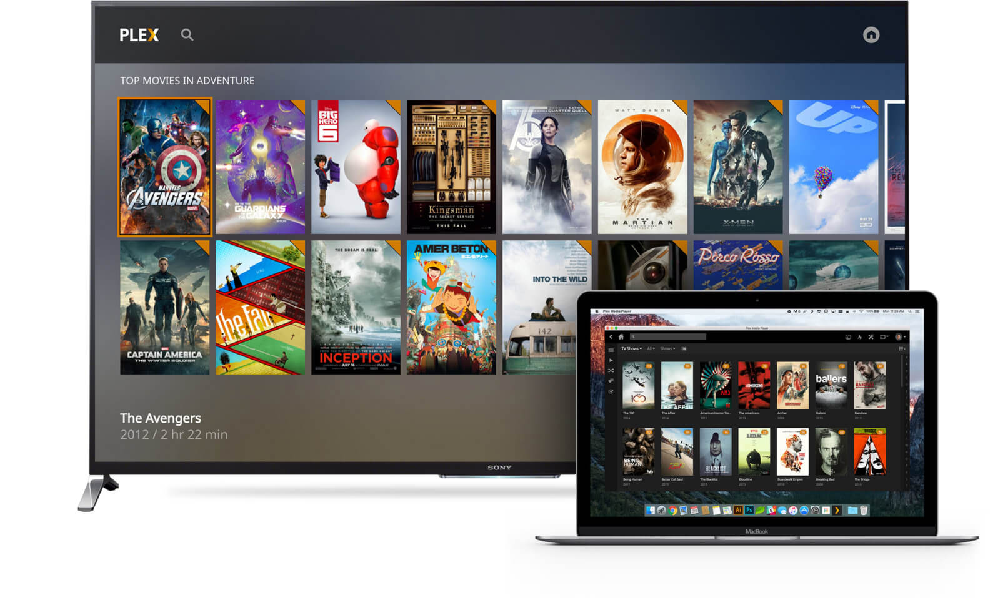

If it does not suit you, there is also now an official [Kodi add-on for Plex](https://www.plex.tv/apps/computer/kodi/). [Download Kodi](http://kodi.wiki/view/HOW-TO:Install_Kodi_for_Linux), then browse add-ons to find Plex.

Also the old good Plex Home Theater is still available, in an open source version called [OpenPHT](https://github.com/RasPlex/OpenPHT).

Personal choice: after using OpenPHT for a while I'll give Plex Media Player a try. I might miss the ability to live-edit subtitle offset, but sub-zero is supposed to do its job. We'll see.

### Setup Sonarr

#### Docker container

Guess who made a nice Sonarr Docker image? Linuxserver.io !

Let's go:

```yaml
sonarr:
    container_name: sonarr
    image: linuxserver/sonarr:109
    restart: unless-stopped
    network_mode: host
    environment:
      - PUID=1000 # default user id, for downloaded files access rights
      - PGID=1000 # default group id, for downloaded files access rights
      - TZ=Europe/Paris # timezone
    volumes:
      - /etc/localtime:/etc/localtime:ro
      - ${HOME}/.config/sonarr:/config # config files
      - /media/${USER}/data1/downloads/complete/Series:/tv # tv shows folder
      - /media/${USER}/data1/downloads/deluge/complete:/downloads # deluge download folder
```

`docker-compose up -d`

Sonarr web UI listens on port 8989 by default. You need to mount your tv shows directory (the one where everything will be nicely sorted and named). And your download folder, because sonarr will look over there for completed downloads, then move them to the appropriate directory.

#### Configuration

Sonarr should be available on `localhost:8989`. Go straight to the `Settings` tab.

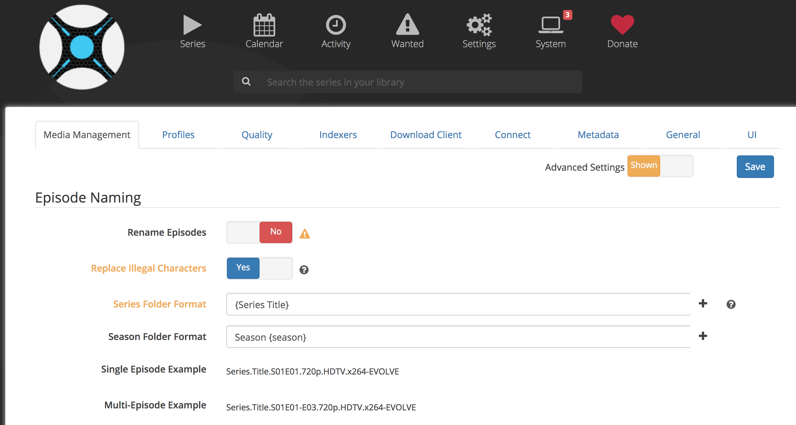

Enable `Ignore Deleted Episodes`: if like me you delete files once you have watched them, this makes sure the episodes won't be re-downloaded again.
In `Media Management`, you can choose to rename episodes automatically. This is a very nice feature I've been using for a long time; but now I choose to keep original names. Plex sub-zero plugins gives better results when the original filename (containing the usual `x264-EVOLVE[ettv]`-like stuff) is kept.
In `profiles` you can set new quality profiles, default ones are fairly good. There is an important option at the bottom of the page: do you want to give priority to Usenet or Torrents for downloading episodes? I'm keeping the default Usenet first.

`Indexers` is the important tab: that's where Sonarr will grab information about released episodes. Nowadays a lot of Usenet indexers are relying on Newznab protocol: fill-in the URL and API key you are using. You can find some indexers on this [subreddit wiki](https://www.reddit.com/r/usenet/wiki/indexers). It's nice to use several ones since there are quite volatile. You can find suggestions on Sonarr Newznab presets. Some of these indexers provide free accounts with a limited number of API calls, you'll have to pay to get more. Usenet-crawler is one of the best free indexers out there.

For torrents indexers, I activate Torznab custom indexers that point to my local Jackett service. This allows searches across all torrent indexers configured in Jackett. You have to configure them one by one though.

Get torrent indexers Jackett proxy URLs by clicking `Copy Torznab Feed` in Jackett Web UI. Use the global Jackett API key as authentication.


`Download Clients` tab is where we'll configure links with our two download clients: NZBGet and Deluge.
There are existing presets for these 2 that we'll fill with the proper configuration.

NZBGet configuration:


Deluge configuration:


Enable `Advanced Settings`, and tick `Remove` in the Completed Download Handling section. This tells Sonarr to remove torrents from deluge once processed.

In `Connect` tab, we'll configure Sonarr to send notifications to Plex when a new episode is ready:


#### Give it a try

Let's add a series !


*Note: You may need to `chown -R $USER:$USER /path/to/root/directory` so Sonarr and the rest of the apps have the proper permissions to modify and move around files.*

Enter the series name, then you can choose a few things:

- Monitor: what episodes do you want to mark as monitored? All future episodes, all episodes from all seasons, only latest seasons, nothing? Monitored episodes are the episodes Sonarr will download automatically.
- Profile: quality profile of the episodes you want (HD-1080p is the most popular I guess).

You can then either add the serie to the library (monitored episode research will start asynchronously), or add and force the search.


Wait a few seconds, then you should see that Sonarr started doing its job. Here it grabed files from my Usenet indexers and sent the download to NZBGet automatically.


You can also do a manual search for each episode, or trigger an automatic search.

When download is over, you can head over to Plex and see that the episode appeared correctly, with all metadata and subtitles grabbed automatically. Applause !


### Setup Radarr

Radarr is a fork of Sonarr, made for movies instead of TV shows. For a good while I've used CouchPotato for that exact purpose, but have not been really happy with the results. Radarr intends to be as good as Sonarr !

#### Docker container

Radarr is *very* similar to Sonarr. You won't be surprised by this configuration.

```yaml
radarr:
    container_name: radarr
    image: linuxserver/radarr:80
    restart: unless-stopped
    network_mode: host
    environment:
      - PUID=1000 # default user id, for downloaded files access rights
      - PGID=1000 # default group id, for downloaded files access rights
      - TZ=Europe/Paris # timezone
    volumes:
      - /etc/localtime:/etc/localtime:ro
      - ${HOME}/.config/radarr:/config # config files
      - /media/${USER}/data1/downloads/movies:/movies # movies folder
      - /media/${USER}/data1/downloads/ongoing:/downloads # download folder
```

#### Configuration

Radarr Web UI is available on port 7878.
Let's go straight to the `Settings` section.

In `Media Management`, I chose to disable automatic movie renaming. Too bad, but it's helpful for Plex sub-zero plugin to find proper subtitles for the movie (ie. keep that `x264-720p-YIFY` tag to look for the right subtitle). I enable `Ignore Deleted Movies` to make sure movies that I delete won't be downloaded again by Radarr. I disable `Use Hardlinks instead of Copy` because I prefer to avoid messing around what's in my download area and what's in my movies area.

In `Profiles` you can set new quality profiles, default ones are fairly good. There is an important option at the bottom of the page: do you want to give priority to Usenet or Torrents for downloading episodes? I'm keeping the default Usenet first.

As for Sonarr, the `Indexers` section is where you'll configure your torrent and nzb sources.

Nowadays a lot of Usenet indexers are relying on Newznab protocol: fill-in the URL and API key you are using. You can find some indexers on this [subreddit wiki](https://www.reddit.com/r/usenet/wiki/indexers). It's nice to use several ones since there are quite volatile. You can find suggestions on Radarr Newznab presets. Some of these indexers provide free accounts with a limited number of API calls, you'll have to pay to get more. Usenet-crawler is one of the best free indexers out there.
For torrents indexers, I activate Torznab custom indexers that point to my local Jackett service. This allows searches across all torrent indexers configured in Jackett. You have to configure them one by one though.

Get torrent indexers Jackett proxy URLs by clicking `Copy Torznab Feed`. Use the global Jackett API key as authentication.


`Download Clients` tab is where we'll configure links with our two download clients: NZBGet and Deluge.
There are existing presets for these 2 that we'll fill with the proper configuration.

NZBGet configuration:


Deluge configuration:


Enable `Advanced Settings`, and tick `Remove` in the Completed Download Handling section. This tells Radarr to remove torrents from deluge once processed.

In `Connect` tab, we'll configure Radarr to send notifications to Plex when a new episode is ready:


#### Give it a try

Let's add a movie !

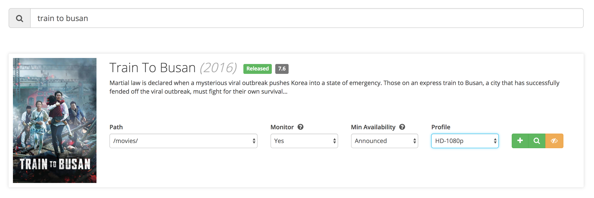

Enter the movie name, choose the quality you want, and there you go.

You can then either add the movie to the library (monitored movie research will start asynchronously), or add and force the search.

Wait a few seconds, then you should see that Radarr started doing its job. Here it grabed files from my Usenet indexers and sent the download to NZBGet automatically.

You can also do a manual search for each movie, or trigger an automatic search.

When download is over, you can head over to Plex and see that the movie appeared correctly, with all metadata and subtitles grabbed automatically. Applause !


#### Movie discovering

I like the discovering feature. When clicking on `Add Movies` you can select `Discover New Movies`, then browse through a list of TheMovieDB recommended or popular movies.

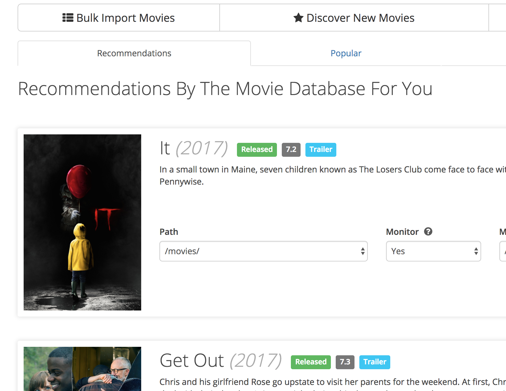

On the rightmost tab, you'll also see that you can setup Lists of movies. What if you could have in there a list of the 250 greatest movies of all time and just one-click download the ones you want?

This can be set up in `Settings/Lists`. I activated the following lists:

- StevenLu: that's an [interesting project](https://github.com/sjlu/popular-movies) that tries to determine by certain heuristics the current popular movies.
- IMDB TOP 250 movies of all times from Radarr Lists presets
- Trakt Lists Trending and Popular movies

I disabled automatic sync for these lists: I want them to show when I add a new movie, but I don't want every item of these lists to be automatically synced with my movie library.

## Manage it all from your mobile

On Android, I'm using [nzb360](http://nzb360.com) to manage NZBGet, Deluge, Sonarr and Radarr.
It's a beautiful and well-thinked app. Easy to get a look at upcoming tv shows releases (eg. "when will the next f**cking Game of Thrones episode be released?").

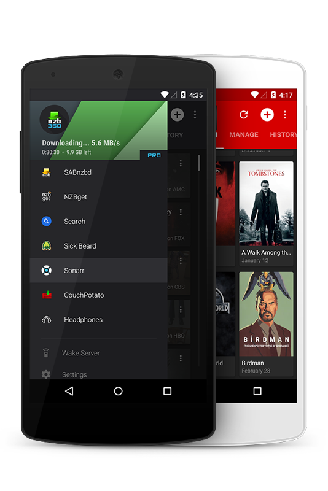

The free version does not allow you to add new shows. Consider switching to the paid version (6$) and support the developer.

## Going Further

Some stuff worth looking at that I do not use at the moment:

- [NZBHydra](https://github.com/theotherp/nzbhydra): meta search for NZB indexers (like [Jackett](https://github.com/Jackett/Jackett) does for torrents). Could simplify and centralise nzb indexers configuration at a single place.
- [Organizr](https://github.com/causefx/Organizr): Embed all these services in a single webpage with tab-based navigation
- [Plex sharing features](https://www.plex.tv/features/#feat-modal)
- [Headphones](https://github.com/rembo10/headphones): Automated music download. Like Sonarr but for music albums. I've been using it for a while, but it did not give me satisfying results. I also tend to rely entirely on a Spotify premium account to manage my music collection now.
- [Mylar](https://github.com/evilhero/mylar): like Sonarr, but for comic books.
- [Ombi](http://www.ombi.io/): Web UI to give your shared Plex instance users the ability to request new content
- [PlexPy](https://github.com/JonnyWong16/plexpy): Monitoring interface for Plex. Useful is you share your Plex server to multiple users.
- Radarr lists automated downloads, to fetch best movies automatically. [Rotten Tomatoes certified movies](https://www.rottentomatoes.com/browse/cf-in-theaters/) would be a nice list to parse and get automatically.
